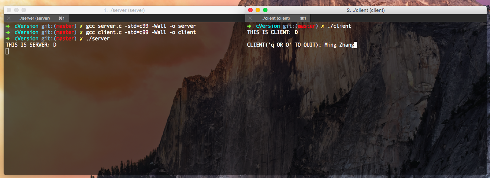
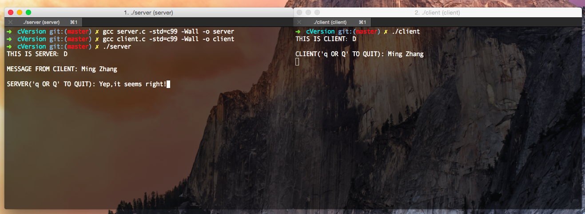
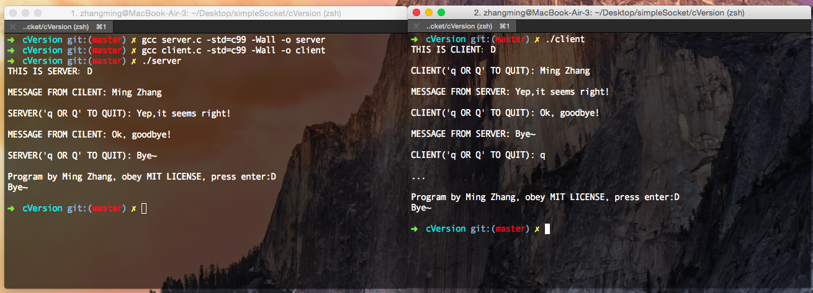

SOCKET Programming in C
=
Based on C, s simple SOCKET program. 
## Develope Environment

|       OS       |            Compiler                |     compile option  |
|----------------|------------------------------------|---------------------|
|  OS X 10.10.5  | LLVM version 7.0.0 (clang-700.1.76)|    -std=c99 -Wall   |

## Prerequisite
You should know about **TCP/IP** protocol and what is **socket**. 

*Brief introduction*

------------------
**Server** 

- **create** a socket
- give server's(means itself) **address**
- **bind** your socket with address
- start **listening** from client
- waiting for cilent's connection, once connected, it will **accept** client's connection
- use the socket getting from acceptation to **receive** and **send** data.
- **close** socket.

------------------
**Client** 

- **create** a socket
- give a server's **address**
- while server start listening, it can make **connect** to server
- while get server's acceptation, it will **receive** and **send** data
- **close** socket.

------------------

## Start 
1. If you are **Mac** or **Linux** user, clone the repository and run it
    
		$ git clone https://github.com/minghust/simpleSocket.git
		$ cd simpleSocket/cVersion
		$ gcc server.c -std=c99 -Wall -o server
		$ gcc client.c -std=c99 -Wall -o client
		$ ./server
		
		then open a new terminal window and change to the same directory as above 
		
		$ ./client
2. If you are **Windows** user, your library may not as the same as mine, you'd better not copy and run for you'll get error.

## Run

## Exceptation
all the cpu bellow has big endian, you should test your cpu first. 
mainly for function **htons** & **htonl** & **inet_aton**

- Motorola680x()
- HP-PA UNIX
- MIPS UNIX
- PowerPC
- RS/6000
- SPARC

## Licence
MIT