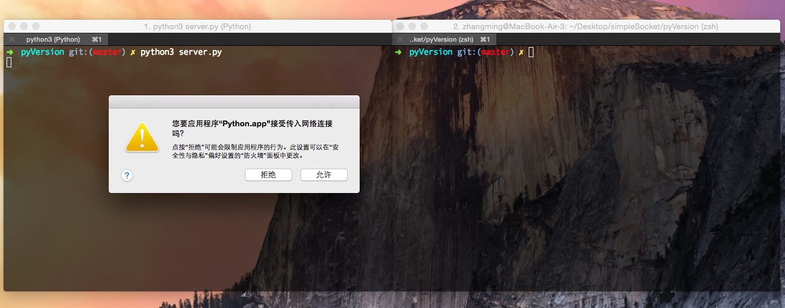
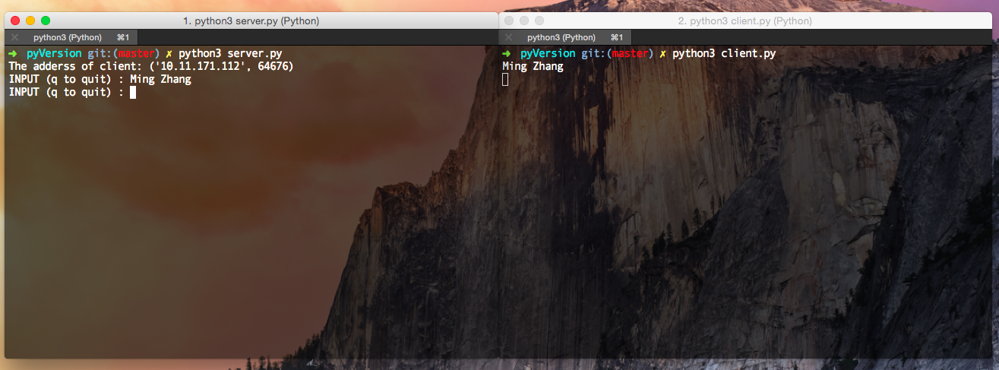
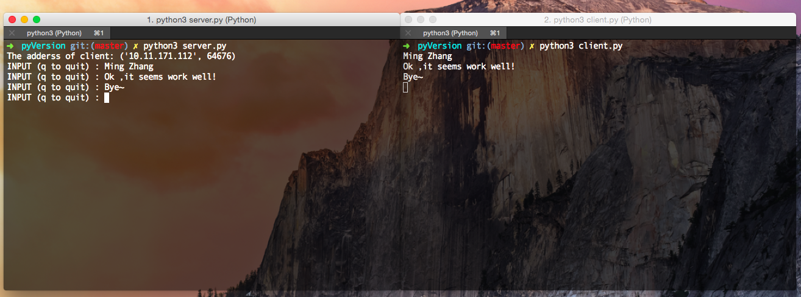
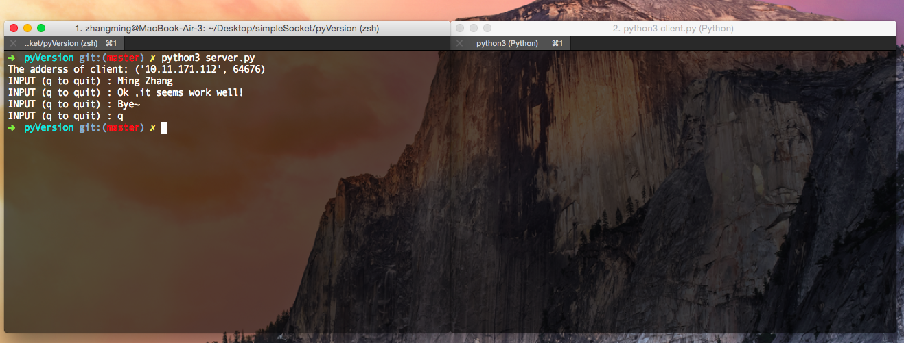

SOCKET programming in Python
==
Based on Python3, a simple SOCKET program. One talk, one listen.
## Develope Environment

|       OS       |            Version           |
|----------------|------------------------------|
|  OS X 10.10.5  | 			Python 3.5.1         |

## Prerequisite
You should know about **TCP/IP** protocol and what is **socket**. 

*Brief introduction*

------------------
**Server** 

- **create** a socket
- give server's(means itself) **address**
- **bind** your socket with address
- start **listening** from client
- waiting for cilent's connection, once connected, it will **accept** client's connection
- use the socket getting from acceptation to **receive** and **send** data.
- **close** socket.

------------------
**Client** 

- **create** a socket
- give a server's **address**
- while server start listening, it can make **connect** to server
- while get server's acceptation, it will **receive** and **send** data
- **close** socket.

------------------

## Start 
If you are **Mac** or **Linux** or **Windows**user, clone the repository and run it
    
		$ git clone https://github.com/minghust/simpleSocket.git
		$ cd simpleSocket/pyVersion
		$ python3 server.py
		
		then open a new terminal window and change to the same directory as above 
		
		$ python3 client.py

## Run

## Licence
MIT